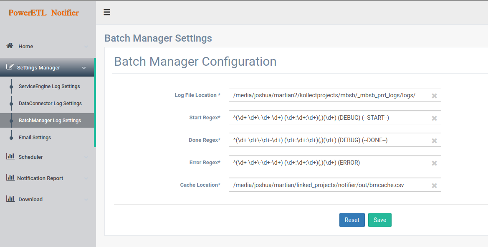

## Dev ops guide


## BatchManager Email Notification 
A couple of setup are required to get notification running for Batch Manager (BM).

The following will need to be updated to suit your environment.


`bmRootPath` This is the path to where BatchManager logs resides.

`batchStartRegex` Regex used to identify the start position of the contents of the log file (Default settings, please don't modify)

`batchDoneRegex` Regex used to identify the end position of the contents of the log file  (Default settings, please don't modify)

`batchErrorRegex` Regex used to identify the errors in the contents of the log file  (Default settings, please don't modify)

`bmCache` Stores the history of BM sent emails. (Default to `../out/bmcache.csv`)

## How do i update these settings?

There are two ways to update these settings. The first method is directly editing the configuration JSON file (not recommended) and the second method is updating using the provided user interface.

### Method 1: Directly updating [bmconfig.json](src/main/resources/config/bmconfig.json) (not recommended)
`bmconfig.json` is the configuration file which stores these settings. 

```json
{
  "bmRootPath": "/media/joshua/martian2/kollectprojects/mbsb/_mbsb_prd_logs/logs/",
  "batchStartRegex": "^(\\d+ \\d+\\-\\d+-\\d+) (\\d+:\\d+:\\d+)(,)(\\d+) (DEBUG) (--START--)",
  "batchDoneRegex": "^(\\d+ \\d+\\-\\d+-\\d+) (\\d+:\\d+:\\d+)(,)(\\d+) (DEBUG) (--DONE--)",
  "batchErrorRegex": "^(\\d+ \\d+\\-\\d+-\\d+) (\\d+:\\d+:\\d+)(,)(\\d+) (ERROR)",
  "bmCache": "/media/joshua/martian/linked_projects/notifier/out/bmcache.csv"
}

```

### Method 2: Updating settings from UI (recommended)

A cleaner and less error prone method of updating BM settings is by using the UI. 

![alt text][logo]


```properties

app.ictzone.dc.scheduler.enable=false
app.ictzone.dc.scheduler.cronexpression=0 18 19 * * *
app.ictzone.dc.recepients=kvloading@kollect.my
app.ictzone.dc.serverLogPath=/home/kvalleydb/etl/ictzone-loading/logs/Server.log
app.ictzone.dc.serverLogDir=/home/kvalleydb/etl/ictzone-loading/logs/
app.ictzone.dc.emailTitle=ICTZone KollectValley System Alert: Data Loading
app.ictzone.dc.emailContext=ictzone
app.ictzone.dc.additionalMessages=


```


[logo]: https://gitlab.com/poweretl/powerappslogmonitor/blob/bb3a2d03d6370cb0a2431be3bd56eb6a98a19886/site/bm_ui_settings.png "Logo Title Text 2"

